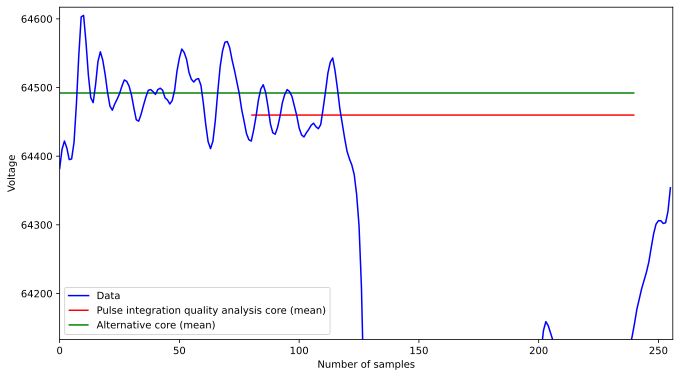
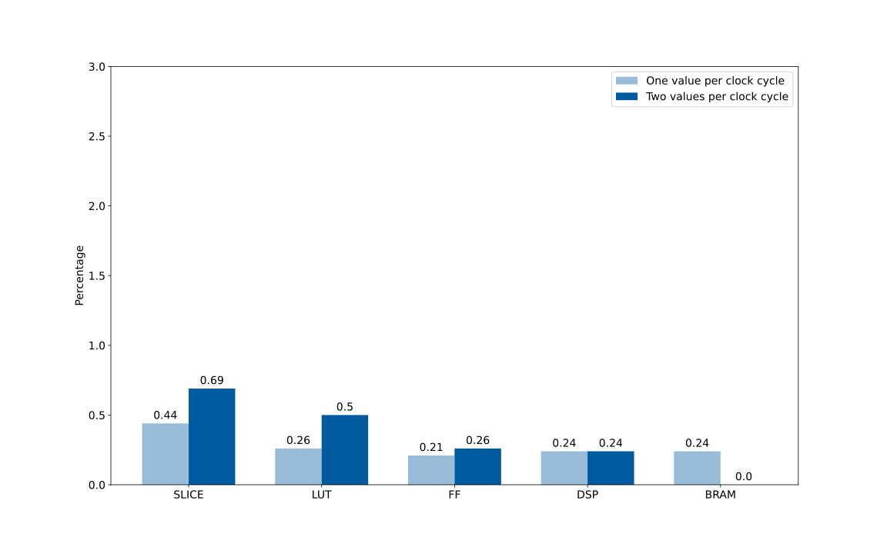
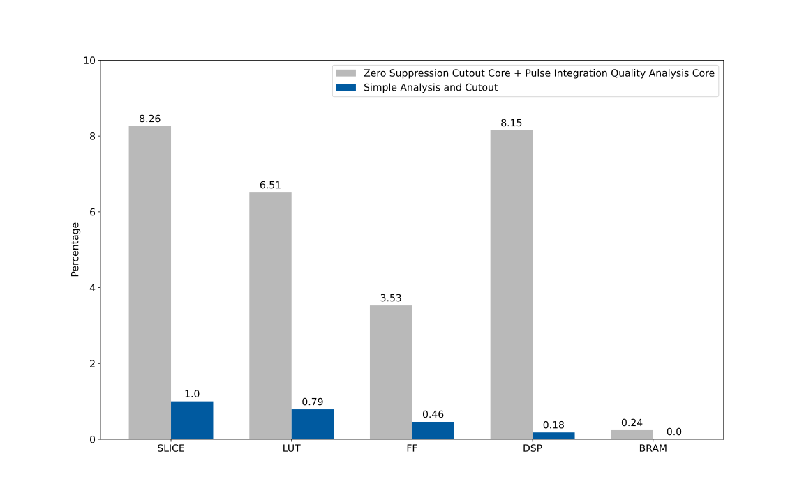

# Moving Window Deconvolution and Simple Analysis & Cutout
Currently there are two experimental algorithms:

Algorithm | Implementation | Description
---|---|---
Moving Window Deconvolution   (original: Moving Window Deconvolution by Nam Tran) | MWD.cpp: <ul><li> [one value per cycle](MWD_one_value_per_cycle/MWD.cpp) </li><li> [two values per cycle](MWD_two_values_per_cycle/MWD.cpp) </li></ul> | <ul><li> Suppress constant exponential decay in input data </li><li> Calculate difference before and after rising edge </li><li> Compute average </li> <li> Compute maximum over pulse </li></ul>
Simple Analysis and Cutout   (original: Edge-finding Trigger by Jijun Chen, Shihua Huang, Dave Koltick) | analysis_core.cpp: <ul><li> [two value per cycle](simple_analysis_and_cutout_core/analysis_core.cpp) </li></ul> | <ul><li> Maintain baseline if there is currently no pulse </li><li> Find edge </li><li> Compute back pedestal and integrate pulse </li><li> Compare baseline and back pedestal for quality analysis </li><li> Return difference of baseline and pulse integration </li></ul>

## Difference between Simple Analysis and Cutout Core and Pulse Integration Quality Analysis Core
* **Don't allows odd parameters**
    * shouldn't make a difference, especially if constant fraction discriminator is implemented in the future
    * simplifies the logic (easier to understand and reduces resource consumption)
* **Uses low pass filter instead of mean filter**
    * leads to deviations in the output because the baseline is averaged over more values (possibly higher accuracy?)
    * allows more freedom when changing the parameters at runtime (`Delta_PF` is not bound by `max_trigger_delay`)
* **Additionally cutout pulses**

### Difference between low pass filter and mean filter

## Interfaces
### Moving Window Deconvolution
* **Input data format for test bench:** floating point numbers (file with one pulse per line, values separated by one space)

#### One Value Per Clock Cycle Implementation
* **Input:** Two streams of 32 bit floating point numbers and a boolean that indicates the end of a pulse
* **Output:** Two streams with one value per pulse (one 32 bit floating point height and one 64 bit integer time)

#### Two Values Per Clock Cycle Implementation
* **Input:**  Three streams of 32 bit floating point numbers and one boolean that indicates the end of a pulse
* **Output:**  Two streams with one value per pulse (one 32 bit floating point height and one 64 bit integer time)

### Simple Analysis and Cutout
* **Input data for test bench:** 32 bit integers, file with one value per line (can be executed with the same data as the pulse_inegration_quality_analysis core with two values per clock cycle)
* **Input:**  Two streams of 32 bit integers
* **Output:**  
    * Three streams with one value per pulse (one 64 bit integer pulse time, one 32 bit floating point pulse energy, one 32 bit integer quality [0, 1 or 2])
    * Four streams (two 64 bit integers time and two 32 bit integers cut out data)

## Resource Usage

The FPGA in the DAQ of the STM experiment at Fermilab is a Xilinx Kintex-7 `xc7k420t-ffg1156-2`.

FPGA | Total SLICE | Total LUT | Total FF | Total DSP | Total BRAM
---|---|---|---|---|---
Kintex-7 (xc7k420t-ffg1156-2) | 74650 | 260600 | 521200 | 1680 | 835

### Moving Window Deconvolution

CP required: 6.000  
Uncertainty: default (12.5%)

Algorithm | Optimized | Timing in ns | SLICE | LUT | FF | DSP | BRAM | Time per Pulse in ns
---|---|---|---|---|---|---|---|---
One value per cycle | yes | 5.394 | 331 | 672 | 1094 | 4 | 2 | 13490.394
Two values per cycle | yes | 4.112 | 516 | 1306 | 1358 | 4 | 0 | 5142.056

### Simple Analysis and Cutout

CP required: 6.000  
Uncertainty: default (12.5%)

Algorithm | Optimized | Timing in ns | SLICE | LUT | FF | DSP | BRAM | Time per Pulse in ns
---|---|---|---|---|---|---|---|---
Two values per cycle | yes | 5.108 | 743 | 2046 | 2417 | 3 | 0 | 1282.108

