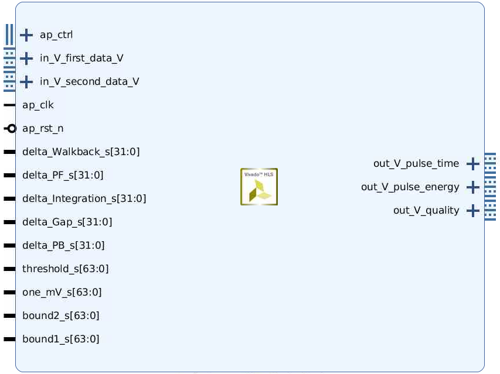
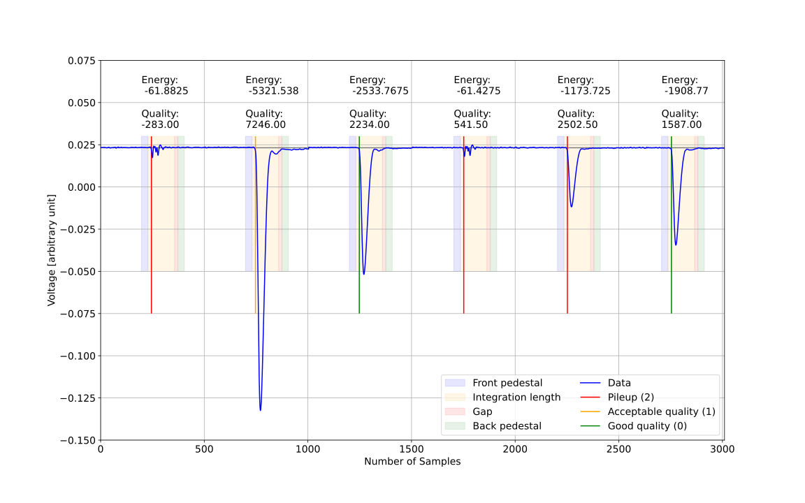
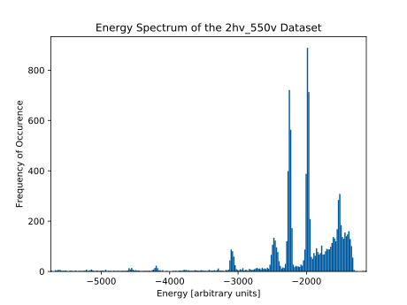
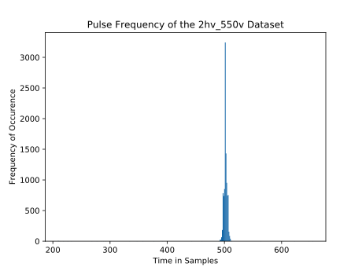
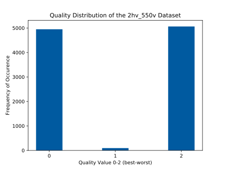
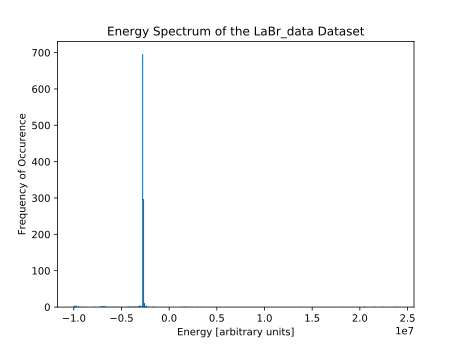
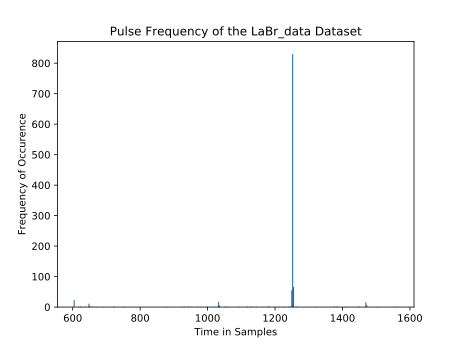
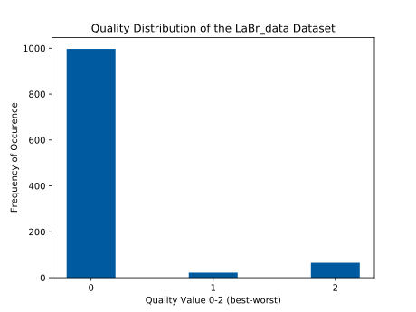
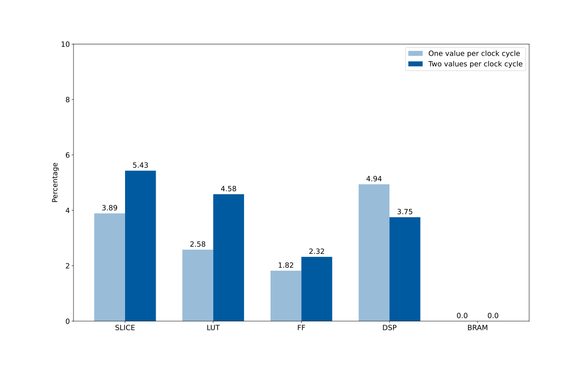

# Pulse Integratione Quality Analysis
Algorithm | Implementation | Description
---|---|---
Pulse Integration Quality Analysis   (original: Edge-finding Trigger by Jijun Chen, Shihua Huang, Dave Koltick) |  pulse_integration_quality_analysis_core.cpp: <ul><li> [one value per cycle](one_value_per_cycle/pulse_integration_quality_analysis_core.cpp) </li><li> [two values per cycle](two_values_per_cycle/pulse_integration_quality_analysis_core.cpp) </li></ul> | <ul><li> Find edge </li><li> Compute front pedestal, back pedestal and integrate pulse </li><li> Compare front and back pedestal for quality analysis </li><li> Return difference of baseline and pulse integration </li> <li> CFD is not implemented </li></ul>

## Interfaces
The parameters of the two values per cycle implementation can be changed every time the core is started. `Delta_PF` + `delta_Walkback` may not exceed `max_trigger_delay` (changeable in [pulse_integration_quality_analysis_core.h](two_values_per_cycle/pulse_integration_quality_analysis_core.h)).

In the one value per cycle implementation, the default parameters are the provided default parameters. The two values per cycle implementation requires rescaled data. The default parameters are eqivalent to the provided default parameters, if the following function is used to rescale the data: `data_int16 = data_float * 400_000 + 55200`

### One Value Per Clock Cycle Implementation
* **Input data for test bench:** floating point numbers (file with one value per line)
* **Input:** One stream of 51 bit floating point numbers
* **Output:** Three streams with one value per pulse (one 64 bit integer pulse time, one 64 bit double precision floating point pulse energy, one 32 bit integer quality [0, 1 or 2])
### Two Values Per Clock Cycle Implementation
* **Input data for test bench:** 16 bit unsigned integers (file with one value per line)
* **Input:** Two streams of 16 bit unsigned integers
* **Output:** Three streams with one value per pulse (one 64 bit integer pulse time, one 64 bit double precision floating point pulse energy, one 32 bit integer quality [0, 1 or 2])

Block Diagram | Stream Diagram
---|---
 | 

## Visualization

Data | Integration | Pulse Frequency | Quality
---|---|---|---
2hv_550v (default parameters) |  <ul><li> Multiple peaks as expected </li></ul> |  <ul><li> Pulses at regular intervals </li></ul> |  <ul><li> ~50% chance of poor quality </li> <li> Quality calculation does not work, because poor quality is detected if front pedestal more negative than back pedestal </li></ul>
LaBr_data (manually optimized parameters) |  <ul><li> Single narrow peak </li></ul> |  <ul><li> Pulses at regular intervals (guaranteed because data set of cut out pulses) </li></ul> |  <ul><li> Quality calculation is very accurate, because poor quality is detected if front pedestal more negative than back pedesta </li></ul>

## Resource Usage
The FPGA at the STM experiment at Fermilab is a Xilinx Kintex-7 `xc7k420t-ffg1156-2`.

FPGA | Total SLICE | Total LUT | Total FF | Total DSP | Total BRAM
---|---|---|---|---|---
Kintex-7 (xc7k420t-ffg1156-2) | 74650 | 260600 | 521200 | 1680 | 835

CP required: 6.000  
Uncertainty: default (12.5%)

Algorithm | Optimized | Timing in ns | SLICE | LUT | FF | DSP | BRAM | Time per Pulse in ns
---|---|---|---|---|---|---|---|---
One value per clock cycle | yes | 5.500 | 2904 | 6721 | 9500 | 83 | 0 | 2761.000
Two values per clock cycle | yes | 5.612 | 4057 | 11923 | 12088 | 63 | 0 | 1408.612

