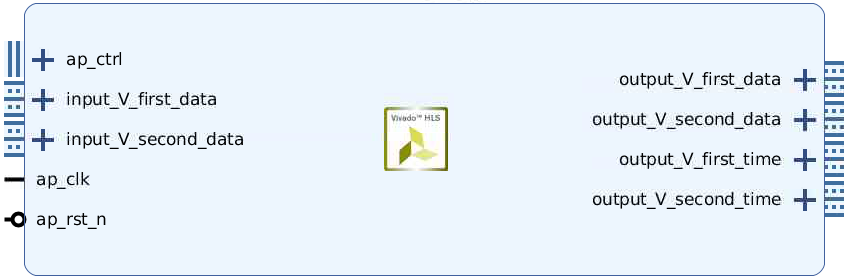
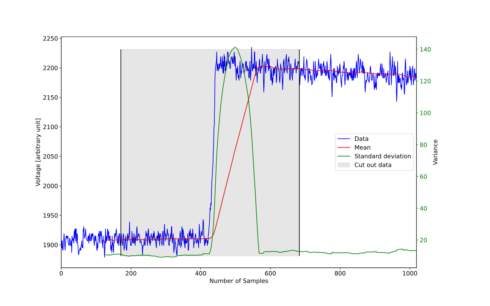
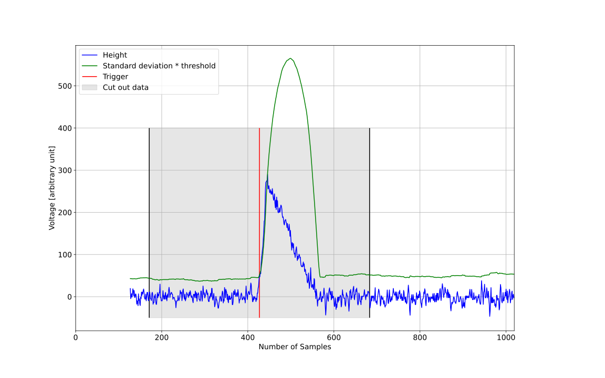
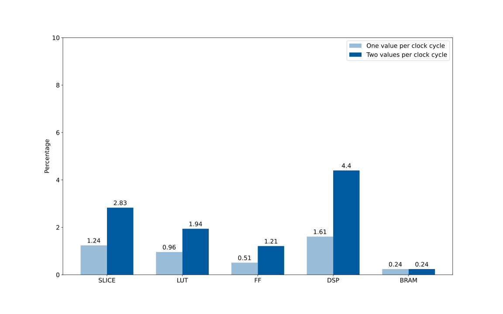

# Zero Suppression Cutout
Algorithm | Implementation | Description
---|---|---
Zero Suppression Cutout   (original: Zero Suppression by Nam Tran) | zero_suppression_cutout_core.cpp: <ul><li> [one value per cycle](one_value_per_cycle/zero_suppression_cutout_core.cpp) </li><li> [two values per cycle](two_values_per_cycle/zero_suppression_cutout_core.cpp) </li></ul> | <ul><li> Calculation of standard deviation and mean with sliding window </li><li> Find rising edge (mean > standard deviation * threshold) </li><li> Return data around trigger </li></ul>

## Interfaces
* **Input for test bench:** 16 bit unsigned integers (file with one pulse per line, values separated by one space)

### One Input Value Per Clock Cycle Implementation
* **Input:** One stream of 16 bit unsigned integers
* **Output:** Two streams (one 64 bit integers time and one 16 bit unsigned integers cut out data)

### Two Input Values Per Clock Cycle Implementation
* **Input:** Two streams of 16 bit unsigned integers
* **Output:** Four streams (two 64 bit integers time and two 16 bit unsigned integers cut out data)

Block Diagram | Stream Diagram
---|---
 | 

## Visualization
### Mean and Standard deviation of one Pulse

### Trigger Condition

## Resource Usage
The FPGA at the STM experiment at Fermilab is a Xilinx Kintex-7 `xc7k420t-ffg1156-2`.

FPGA | Total SLICE | Total LUT | Total FF | Total DSP | Total BRAM
---|---|---|---|---|---
Kintex-7 (xc7k420t-ffg1156-2) | 74650 | 260600 | 521200 | 1680 | 835

CP required: 6.000  
Uncertainty: default (12.5%)

Algorithm | Optimized | Timing in ns | SLICE | LUT | FF | DSP | BRAM | Time per Pulse in ns
---|---|---|---|---|---|---|---|---
One value per clock cycle | yes | 5.098 | 924 | 2490 | 2655 | 27 | 2 | 5194.862
Two values per clock cycle | yes | 5.298 | 2109 | 5051 | 6329 | 74 | 2 | 2699.331

